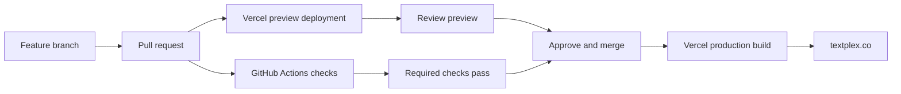
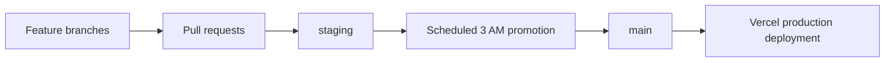

# TextPlex GitHub and Vercel Deployment Plan

**Status:** Recommended operating model

This document describes the recommended transition from the public GitHub Pages compatibility site to a private GitHub repository with Vercel as the canonical web deployment platform.

## Executive recommendation

- Make the TextPlex GitHub repository private if the codebase is now proprietary business software.
- Keep GitHub as the source of truth for branches, pull requests, reviews, merges, history, and CI.
- Use Vercel for the canonical Next.js web application at `textplex.co`.
- Use GitHub Actions as the required quality gate before production merges.
- Let Vercel create previews for pull requests and deploy production after approved merges into `main`.
- Treat the FastAPI backend as a separate deployment with its own migration, smoke-test, and rollback process.
- Do not take the website offline for ordinary frontend builds. Reserve maintenance mode for risky API or database changes.

Vercel supports GitHub repositories, including private repositories, and can create preview deployments for branches and pull requests. Production deployments are normally created when changes merge into the configured production branch, commonly `main`.

References:

- [Vercel: Deploying Git Repositories](https://vercel.com/docs/git)
- [Vercel: Deploying GitHub Projects](https://vercel.com/docs/git/vercel-for-github)
- [GitHub: Setting repository visibility](https://docs.github.com/en/repositories/managing-your-repositorys-settings-and-features/managing-repository-settings/setting-repository-visibility)

## Private repository transition

Before changing the repository visibility:

1. Search the full Git history for API keys, tokens, passwords, private URLs, and other credentials. Rotate anything that has ever been committed, even if it was later deleted.
2. Confirm that `textplex.co` DNS points to Vercel rather than GitHub Pages.
3. Confirm that the Vercel GitHub integration has access to the repository.
4. Decide whether the repository should remain under a personal GitHub account or move to a business GitHub organization.
5. Preserve any public documentation, marketing material, or open-source code in a separate public repository if those should remain public.

Changing a public repository to private automatically unpublishes a GitHub Pages site. Public forks and previously downloaded copies are not erased. If GitHub Pages is no longer needed, that is the desired outcome.

Because TextPlex is intended to become a commercial product, use a Vercel Pro or Enterprise plan rather than relying on the Hobby plan. Vercel states that Hobby is limited to personal, non-commercial use. A Vercel Hobby team also cannot connect a project to a GitHub organization-owned repository.

References:

- [Vercel Hobby Plan](https://vercel.com/docs/plans/hobby)
- [Vercel Fair Use Guidelines](https://vercel.com/docs/limits/fair-use-guidelines)
- [Vercel Account Plans](https://vercel.com/docs/plans)

## GitHub Pages retirement

The repository currently contains a Pages workflow at `.github/workflows/pages.yml` that publishes the static `site/` shell from pushes to `main`.

After the Vercel deployment is verified:

- Disable or remove the Pages deployment workflow.
- Keep `site/` temporarily if it is useful for comparison or rollback reference.
- Remove the legacy shell only after the production cutover and rollback evidence are complete.
- Update the privacy and third-party service documentation when GitHub Pages is no longer an active service.

The canonical web application is the Next.js app under `apps/web/`. The static site is a legacy compatibility surface, not the primary product deployment.

## Recommended release flow

### Pull requests

Every meaningful change should go through a pull request, even when there is only one developer. The pull request provides:

- A Vercel preview URL for visual and functional review.
- GitHub Actions results for API tests, processor tests, web tests, build, lint, and container smoke checks.
- A durable record of what changed and why.
- A controlled point for reverting or postponing a release.

Configure the `main` branch so the relevant GitHub Actions checks must pass before merging. The existing workflow is `.github/workflows/ci.yml`.

### Production

Configure the Vercel project with:

- **Production branch:** `main`
- **Repository root:** the repository root, because the workspace lockfile and build scripts live there
- **Install command:** `npm ci`
- **Build command:** `npm run build:web`
- **Production mode:** do not set `TEXTPLEX_SITE_MODE=static`
- **API origin:** configure `TEXTPLEX_API_ORIGIN` as a Vercel environment variable
- **Secrets:** store Supabase and other provider credentials in Vercel or the backend secret manager, never in Git

The root-level workspace configuration currently drives the web build through `npm run build:web`. Verify these settings with a Vercel preview before assigning the production domain.

## Backend deployment boundary

Vercel deployment of the Next.js application does not automatically deploy the FastAPI service. The API needs a separate deployment target and release process.

The backend release should be:

1. Build a versioned API image or package from the approved Git commit.
2. Run the API and processor test suites.
3. Run database migration checks and readiness checks.
4. Back up production data before a schema or storage migration.
5. Deploy to a preview or staging API environment.
6. Run authenticated smoke tests against the staging environment.
7. Promote the tested version to production.
8. Keep the previous version available for rollback.

The existing operational baseline is documented in [`OPERATIONS_RUNBOOK.md`](OPERATIONS_RUNBOOK.md), and the production/preview separation concept is documented in [`API_ENVIRONMENT_SEPARATION_CONCEPT.md`](API_ENVIRONMENT_SEPARATION_CONCEPT.md).

## Maintenance window

Normal Vercel frontend deployments should not require a daily outage. Vercel builds a deployment first and then applies the successful deployment to the production domain. A failed build should not replace the current working deployment.

Use the proposed 3:00–4:00 AM Eastern window for:

- Database migrations that cannot be backward compatible.
- API changes that require coordinated frontend and backend changes.
- Data imports, backups, restores, or infrastructure changes.
- Planned operational work that genuinely affects availability.

Do not use the maintenance window merely because a frontend build exists.

If a real maintenance state is needed, implement it as an application-level flag shared by the web and API layers. The flag should:

- Show a clear maintenance page or banner to normal visitors.
- Allow health and readiness checks to continue working.
- Allow an authenticated operator path for verification.
- Be enabled before the migration and disabled only after smoke tests pass.
- Have a documented rollback procedure.

The maintenance flag should live in a controlled backend or configuration store rather than requiring a new frontend deployment to turn maintenance mode on or off.

Suggested public wording:

> Routine TextPlex release checks occur between 3:00 and 4:00 AM Eastern. Most updates are completed without interruption.

## Optional nightly release model

The default recommendation is continuous delivery: merge an approved change into `main`, then let Vercel deploy it.

If nightly batching is still preferred, use a separate release branch:

In that model, changes accumulate on `staging`, GitHub Actions promotes the latest tested commit during the release window, and Vercel tracks `main`. This creates a deliberate release train, but it also delays approved fixes until the next window. It should be adopted only if that delay is intentional.

Vercel Cron is intended to invoke application functions on a schedule; it is not a replacement for GitHub Actions as the source-control and release gate. A scheduled GitHub Actions workflow is the better place to perform a controlled branch promotion or deployment trigger.

## Rollback expectations

Every production release should have:

- The commit SHA that produced it.
- A successful Vercel deployment record.
- Post-deploy web and API smoke checks.
- The previous working deployment or image retained.
- A documented owner and rollback command or dashboard action.

Rollback must restore the previous application version without deleting books, learner data, hosted records, entitlement data, or event history.

## Current TextPlex readiness notes

Already present in the repository:

- Next.js is documented as the canonical app.
- GitHub Actions runs CI checks on pull requests and `main` pushes.
- The static Pages shell is explicitly treated as legacy.
- API readiness and operational runbook documentation exist.
- Container smoke checks cover the canonical web and API routes.

Still required before calling the Vercel production cutover complete:

- Connect and verify the Vercel project against the intended private GitHub repository.
- Configure production and preview environment variables.
- Verify the production domain and authentication callbacks.
- Make GitHub checks required on `main`.
- Run a deployment-owned smoke test against the hosted web and API services.
- Confirm backups, restore evidence, monitoring, and rollback ownership.
- Decide when to disable the GitHub Pages workflow.

These remaining items align with the open production-readiness work in [`FRONTEND_MIGRATION_PHASE_7.md`](FRONTEND_MIGRATION_PHASE_7.md).
